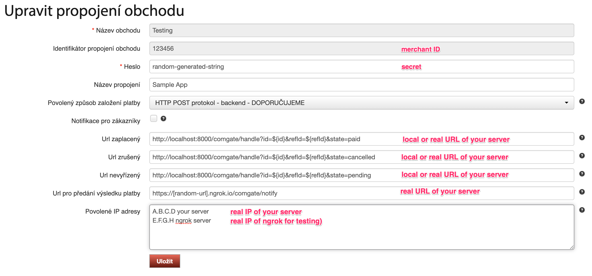

<h1 align=center>ComGate Payments / Playground</h1>

<p align=center>
   🏝 Example PHP project using <a href="https://github.com/comgate-payments/sdk-php">ComGate Payments PHP SDK</a> based on Nette.
</p>
<p align=center>
    Take a look at demo site <a href="https://comgate.herokuapp.com">comgate.herokuapp.com</a>
</p>
<p align=center>
    <a href="https://github.com/comgate-payments/sdk-php/actions"></a>
</p>

-----

## Installation

This demo application is based on [Nette Framework](https://nette.org). You will need `PHP 8.0+` and [Composer](https://getcomposer.org/).

```bash
# Clone repository
git clone https://github.com/comgate-payments/sdk-php.git

# Go to folder
cd example

# Install dependencies
composer install
```

## Configuration

Now you have application installed. It's time configure it. Create file `/config/local.neon` and fill it with these parameters.

```neon
parameters:
	comgate:
		merchant: "foobar"
		secret: "foobar"
		test: true # set false on production
```

Everything is configured. It's time to test it. The easiest way is to use php built-in web server.

```bash
php -S 0.0.0.0:8000 -t www
```

Then visit [http://localhost:8000](http://localhost:8000) in your browser.

## Testing

For real testing we recommend ngrok (https://ngrok.com) for tunneling domain to your local application.



Configuration:

- URL paid: `http://localhost:8000/comgate/handle?id=${id}&refId=${refId}&state=paid`
- URL cancelled: `http://localhost:8000/comgate/handle?id=${id}&refId=${refId}&state=cancelled`
- URL pending: `http://localhost:8000/comgate/handle?id=${id}&refId=${refId}&state=pending`
- URL notify: `https://[random-url].ngrok.io/comgate/notify` (requires ngrok)
